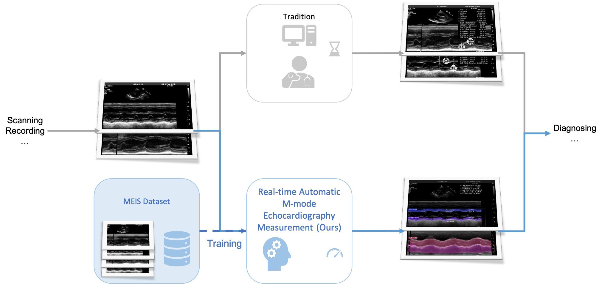
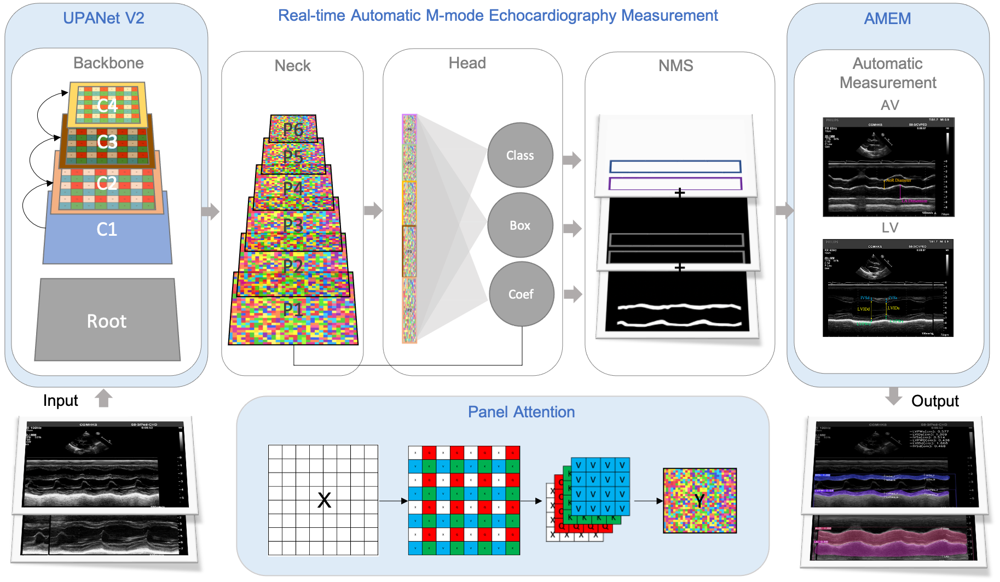
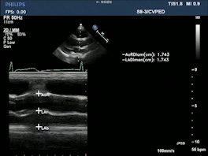
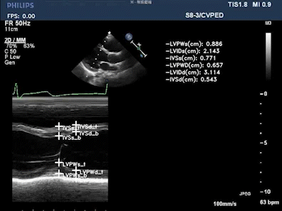
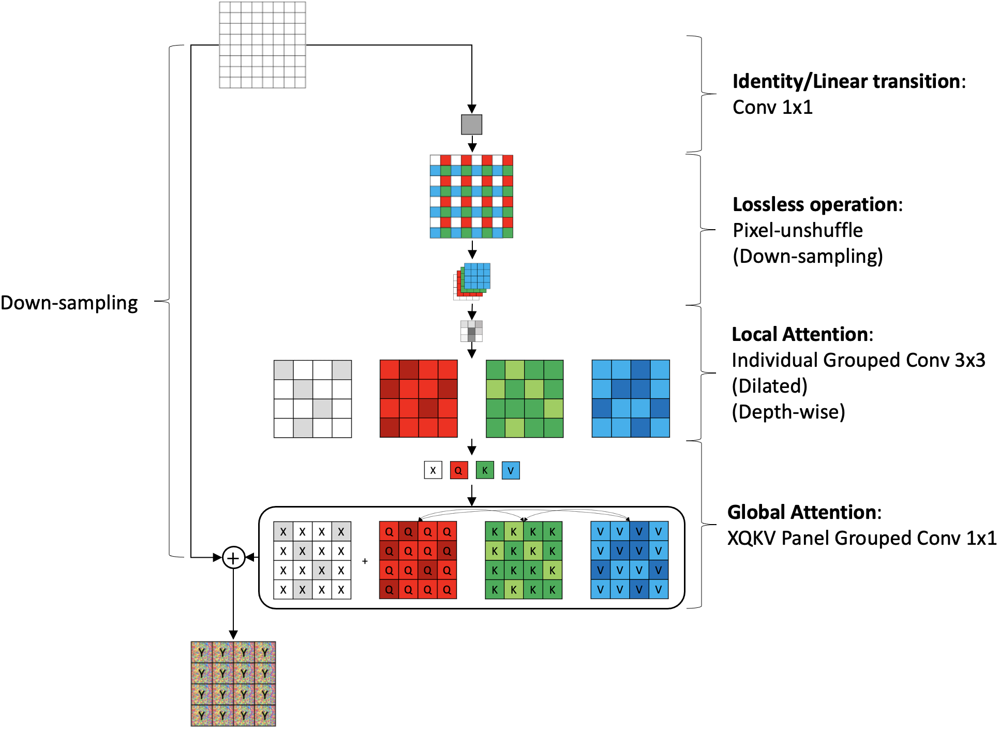
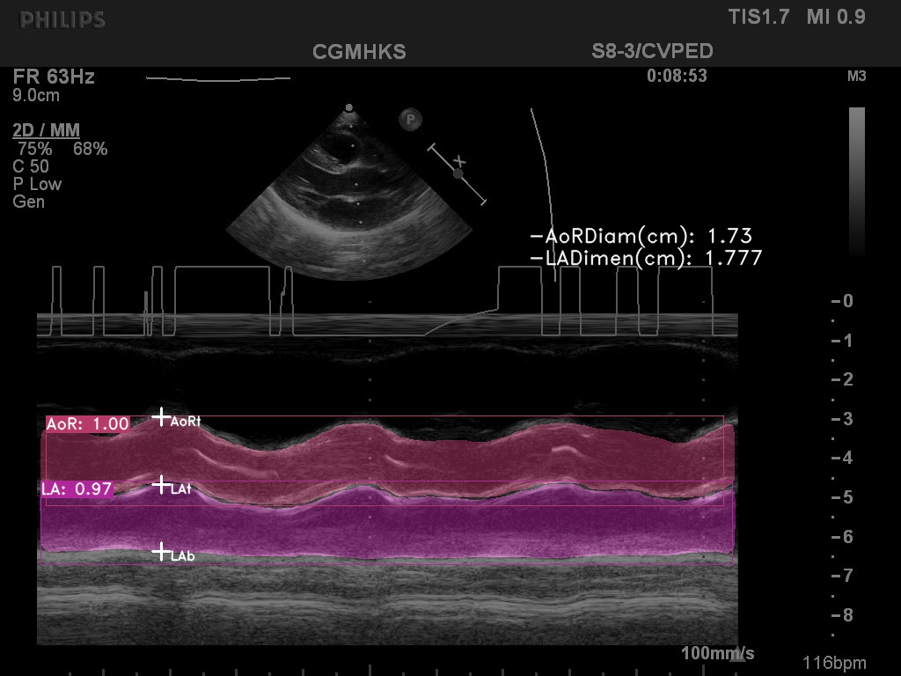
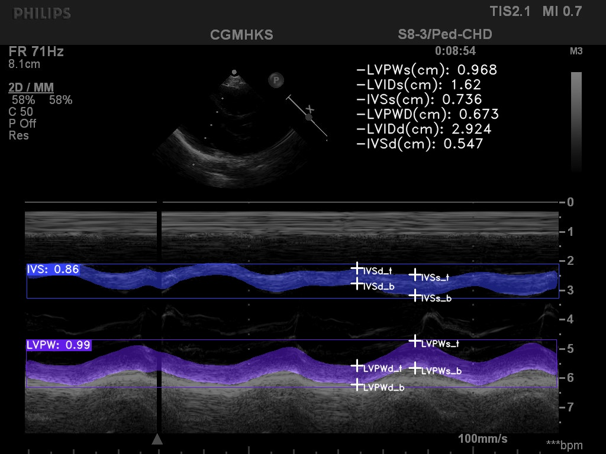

# Real-time Automatic M-mode Echocardiography Measurement with Panel Attention from Local-to-Global Pixels

<p align="center">
  
  <kbd></kbd>
</p>

This is the implemented code of [RAMEM](https://arxiv), Real-time Automatic M-mode Echocardiography Measurement with Panel Attention from Local-to-Global Pixels. This project is modified based on [Yolact_minimal](https://github.com/feiyuhuahuo/Yolact_minimal/tree/master). This project covers:

* **MEIS**, a dataset of M-mode echocardiograms for instance segmentation. 
* **Panel attention**, a depth-wise local-to-global efficient attention
by pixel-unshuffling, embedding with updated **UPANet V2**, updated upon [**UPANet V1**](https://github.com/hanktseng131415go/UPANets).
* **AMEM**, an efficient algorithm for targeting fast and accurate automatic labelling among diagnoses.

<p align="center">
	<sup></sup>(AV)
	<sup></sup>(LV) 1

</p>

# Preparation
Please follow [Yolact_minimal](https://github.com/feiyuhuahuo/Yolact_minimal/tree/master) to set up the needed environment. 

## Datasets
### Opened datasets - PASCAL & COCO
Please follow the same instruction at [Yolact_minimal](https://github.com/feiyuhuahuo/Yolact_minimal/tree/master).

### Proposed dataset - MEIS
Please find **MEIS** (the M-mode echocardiograms dataset in COCO format) at [link](https://drive.google.com/drive/folders/1Ve3UC9pP-FO5wN5MLB9OiKBAs7xAGkeN?usp=sharing).
The main images are in [./raw_image](./raw_image) <sup>2</sup>. The annotations are Allmode\_train.json and Allmode\_test.json. There also are human labelling results in [./data/manual_results.xlsx](./data/manual_results.xlsx) and ground truth raw information in [./data/df_dict](./data/df_dict). The distribution of the dataset is below.

|Type (a)|Object (Mask)|Indicators (b)|Training/Testing (number)|
:--	|:--|:--|:--|
Aortic Valve (AV)|Aortic Root (AoR), Left Atrium (LA)|AoR Diameter, LA Dimension|747/559|
Left Ventricle (LV)|Interventricular Septum (IVS), Left Ventricular Posterior Wall (LVPW)|LVIDs, LVPWs, IVSs, LVIDd, LVPWd, IVSd|774/559|

## Panel attention & UPANets V2
Another core of this work is proposing a new novel efficient non-local attention in UPANets as UPANet V2. The panel attention can be fetched in [./modules/upanets_v2.py](./modules/upanets_v2.py)

<p align="center">
  
</p>

## AMEM
Finally, the last core of this work is an automatic M-mode echocardiography measurement, AMEM. The algorithm can be seen below with implemented code in [./detect.py](./detect.py). For different types in av and lv, functions of `measure_av` and `measure_lv` in [./detect.py](./detect.py) are designed accordingly.

<p align="center">
  
</p>

## Weights
There are six weight groups in this project from **UPANet V2** (the proposed backbone) in maYOLACT to existing works or different backbones (works: maYOLACT and RTMDet, backbones: maDarkNet and SwimTransformer_Tiny). Please fetch each weight according to the number link #.

|#|Work|Backbone|PASCAL Avg-mAP|PASCAL FPS|MEIS Avg-mAP|MEIS FPS|FLOPs (G)|Size (M)|
:--	|:--|:--|:--|:--|:--|:--|:--|:--
[1](https://drive.google.com/drive/folders/1N50XaKtGF5OExmrGDHcsxJpCbonDqd44?usp=sharing)|YOLACT|ResNet50|35.73|81.11|-|-|48.26|**30.38**|
[2](https://drive.google.com/drive/folders/1VnOf4Z7MO-diwxKbJTQxvDEsQv4FJjnW?usp=sharing)|maYOLACT|ResNet50|37.39|**81.27**|46.29|36.13|48.26|**30.38**|
[3](https://drive.google.com/drive/folders/1M5j5zEe0NuT7xaMck5XHZ_uj4l5KjUkm?usp=sharing)|maYOLACT|CSP-DarkNet|40.29|80.36|46.18|34.65|61.73|45.40|
[4](https://drive.google.com/drive/folders/1DqtyN5vj-iNxtSz6QgyDBf1pcENgqzHR?usp=sharing)|maYOLACT|SwimTransformer (Tiny)|21.30|71.88|39.55|**32.99**|**24.96**|33.80|
[5](https://drive.google.com/drive/folders/1zkqWpMek9Ki5VuUi1uFHb-09B8yzJejC?usp=sharing)|RTMDet (ins-X)|CSP-DarkNet|32.39|68.42|44.75|56.22|93.87|80.37|
[6](https://drive.google.com/drive/folders/1nyMkpkOUUPbbvHJu833K_Qx45vEnFzmc?usp=sharing)|Ours (maYOLACT)|UPANet80 V2|**42.69**|60.93|**47.15**|52.22|100.85|40.28|

# Implementation
The primary implementation is [./main.py](./main.py), which allows to switch between training, evaluation, and detection. Please note that this project only supports one GPU operation.

## Training
### End-to-end
```
# Basic training UPANet80 V2 with default setting from end-to-end on PASCAL 2012 SBD,
python main.py --env_path='/ur_env_path' --train=True --resume=False --cfg=upanet80_pascal -- train_bs=8

# Basic training UPANet80 V2 with default setting from end-to-end on MEIS, train_bs=9 is to prevent error in random batch size with no ground truth bounding box after data augmentation in the last one data.
python main.py --env_path='/ur_env_path' --train=True --resume=False --cfg=upanet80_meis -- train_bs=9
```

### Resume (Fine-tuning)
```
python main.py --env_path='/ur_env_path' --train=True --resume=True --cfg=upanet80_* -- train_bs=* --weight='/ur_weight_path'
```

## Evaluation
### Evaluation w/o measurement (in MEIS)
If `--train=True` and `--plot_every_iters=1`, the evaluation will be implemented every epoch.

```
python main.py --env_path='/ur_env_path' --train=True --plot_every_iters=1 --resume=True --cfg=upanet80_* -- train_bs=*
```

If a direct evaluation is needed, set `--train=False` and `resume=True` along with `--weight='/ur_weight_path'` will do.

```
python main.py --env_path='/ur_env_path' --train=False --resume=True --cfg=upanet80_* --weight='/ur_weight_path'
```

### Evaluation w/ measurement (in MEIS)
If AMEM is wanted upon M-mode echocardiography evaluation, please set `--measure==True`, `--scaler=True` for auto scaler detecting from OCR, `--scaler=*` for manual setting scaler, `--eval_humans=True` for calculating error compared with humans results. 

```
python main.py --env_path='/ur_env_path' --train=False --resume=True --cfg=upanet80_* --weight='/ur_weight_path' --measure==True --scaler=True --eval_humans=True 
```

## Detection
### Image detection
This project can automatically label a pile of images from a folder in `--image` for general labelling upon captured images from ultrasound machines. 

```
python main.py --env_path='/ur_env_path' --train=False --resume=True --cfg=upanet80_* --weight='/ur_weight_path' --measure==True --scaler=True --eval_humans=False --image='/ur_image_folder_path' --image_detect=True
```
The AV (left) and LV (right) labelling results based on prediction mask in a real-time instance segmentation can be as the following.




### Video detection
There are two routes to get the detected results for real-time detection via video. One is directly showing the result through cv2 windows, which could slow down the speed to slightly under real-time. By setting `--video`, `--video_detect=True`, and `--show_img=True`

```
python main.py --env_path='/ur_env_path' --train=False --resume=True --cfg=upanet80_* --weight='/ur_weight_path' --measure==True --scaler=True --eval_humans=False --video='/ur_video_folder_path' --video_detect=True --show_img=True
```

Another one is to scan video in the background without showing through cv2 directly, which will need to set `--save_image=True` to save each detected frame result as a temporary image. And then, the frames will be collected into a video. The demo above shows a real-time detection through input to the detection result <sup>3</sup>.

```
python main.py --env_path='/ur_env_path' --train=False --resume=True --cfg=upanet80_* --weight='/ur_weight_path' --measure==True --scaler=True --eval_humans=False --video='/ur_video_folder_path' --video_detect=True --save_img=True
```

# Note

*<sup>1</sup> The demo is generated by AMEM (our proposed algorithm) upon the video.*

*<sup>2</sup> In /raw\_image, the file name follows a policy that the first number name is the raw image and the second number name is ground truth with medical manual labelling (instead of .json labelling).*

*<sup>3</sup> For declaration, by the example of YOLACT, the real-time calculation is from input to NMS (Non-maximum suppression). The general agreement is either >30 or >24 FPS. However, this coverage is certainly not practical in real-world detection, as it could ignore the full-stack operation computational overhead. Here, we have no intention to cover or fix this dilemma as well. This work, instead, only shows the possibility of making a real-time (taking >24 FPS) detection from input to detection results (after M-mode echocardiography measurement) and nearly real-time capability in showing the detection directly. An improvement in speed and optimisation is definitely needed in the future.*


